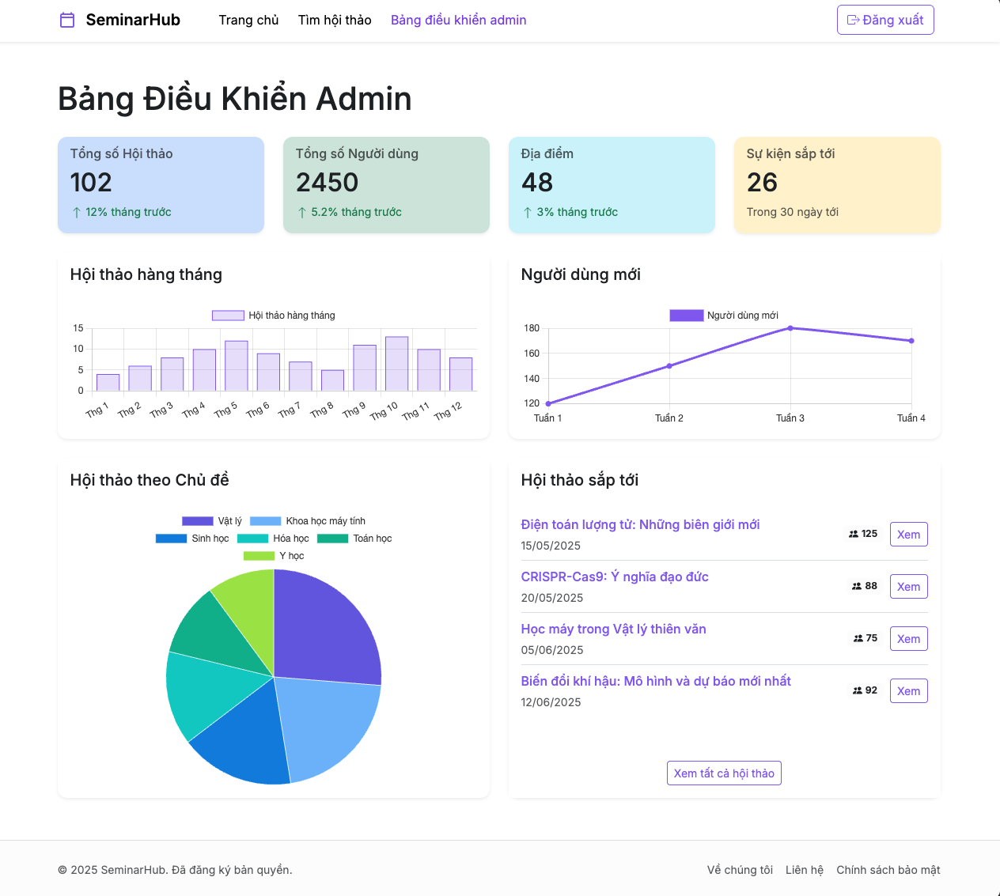

# SeminarHub

SeminarHub is a web application for discovering, managing, and enrolling in academic and scientific seminars. It provides features for users, moderators, and administrators.




## Features

- **Seminar Discovery:** Browse and search for seminars by topic, date, or keyword.
- **Seminar Details:** View detailed information about each seminar, including description, agenda, location (with map integration), presenter, and enrollment numbers.
- **User Enrollment:** Registered users can enroll in seminars.
- **My Enrollments:** Users can view a list of seminars they have enrolled in.
- **Moderator Dashboard:** Moderators can manage seminars (create, edit, delete) and view seminar lists.
- **Admin Dashboard:** Administrators can view site statistics, including total seminars, users, locations, upcoming events, and growth trends visualized with charts.
- **Role-Based Access Control:** Different features are available based on user roles (User, Moderator, Admin).
- **Responsive Design:** Adapts to various screen sizes using Bootstrap.

## Technologies Used

This project is built with:

- **Vite:** Fast frontend build tool.
- **React:** JavaScript library for building user interfaces.
- **TypeScript:** Typed superset of JavaScript.
- **Bootstrap 5:** CSS framework for styling and layout.
- **React Router DOM:** For client-side routing.
- **React Leaflet:** For interactive map integration (based on Leaflet.js).
- **Chart.js & react-chartjs-2:** For displaying charts in the Admin Dashboard.
- **Sonner:** For toast notifications.
- **date-fns:** For date utility functions.

## Getting Started

To run this project locally, follow these steps:

1.  **Clone the repository:**

    ```sh
    git clone https://github.com/albert2704/SeminarHub.git
    cd SeminarHub
    ```

2.  **Install dependencies:**
    Make sure you have Node.js and npm installed ([install with nvm](https://github.com/nvm-sh/nvm#installing-and-updating)).

    ```sh
    npm install
    ```

3.  **Run the development server:**
    This command starts the Vite development server with hot module replacement (HMR).
    ```sh
    npm run dev
    ```
    The application will typically be available at `http://localhost:5173` (or the next available port).

## Available Scripts

- `npm run dev`: Starts the development server.
- `npm run build`: Builds the application for production.
- `npm run lint`: Lints the codebase using ESLint.
- `npm run preview`: Serves the production build locally for preview.

## Demo Accounts

You can use the following demo accounts to test different roles:

- **User:** Any email/password combination (e.g., `user@example.com` / `password`)
- **Moderator:** `moderator@example.com` / `password`
- **Admin:** `admin@example.com` / `password`
